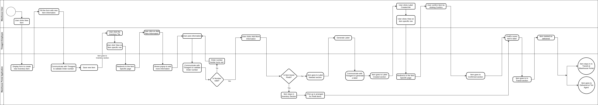

# 1.7.5 Activity Diagram 

According to the flow, the process of creating and manage Inventory Unit will be as follows:

1. Warehouse Admin wants to Add a new Unit
    - Warehouse Admin goes to the Dashboard and clicks "New Unit"
    - Application displays user the form to fill with Unit information
    - Warehouse Admin fill the form with according information
    - Application communicates with Tire Agent to validate order number and so on
    - Application saves an Unit
2. Unit appears on Inventory section for both(TireAgent Eployee and Warehouse Admin) users
3. TireAgent Employee wants to Add more information to Unit and move it to the next state
    - TireAgent Employee clicks the Inventory tile
    - TireAgent Employee clicks View on Unit specific row
    - TireAgent Employee redirects to the Unit specific page
    - TireAgent Employee clicks "Add more information" button
    - Application displays TireAgent Employee the form
    - TireAgent Employee puts an information
    - Application communicate with TA to validate order number
    - TireAgent Employee clicks "Add more information" to save the Unit
        * If Unit brand *is* Pirelli then it stays in Inventory section and Pick Up is arranged for Pirelli Units
        * If Unit brand *is not* Pirelli then Unit goes to Label Needed section
4. TireAgent Employee wants to Generate a label and move the Unit to the next state
    - TireAgent Employee clicks Label needed tile
    - TireAgent Employee clicks View on Unit specific row
    - TireAgent Employee redirects to the Unit specific page
    - TireAgent Employee clicks "Generate label" button
    - Application communicate with TireAgent to generate a label
    - Unit moves to Label Created section
5. Warehouse Admin wants to Confirm an Unit it to the next state
    - Warehouse Admin clicks Label created tile
    - Warehouse Admin clicks View on Unit specific row
    - Warehouse Admin redirects to the Unit specific page
    - Warehouse Admin clicks "Confirm" button
    - Unit moves to "Confirmed" section
6. FedEx scans Unit's label
7. Unit moves to "In transit" section
8. Unit marked as "Delivered"
    - Unit stays in "In transit" section for Warehouse Admin
    - Unit moves to Delivered for TireAgent Employee
