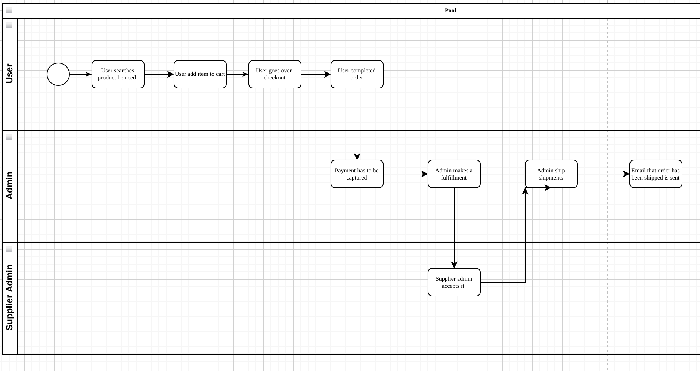

# 1.8.5 Activity Diagram 

According to the flow, the process of creating and manage Inventory Unit will be as follows:

1. User looking for a product 
    - User searches product by vehicle/size
    - User can add product to cart
    - User goes over the checkout
    - User make a payment 
    - User complets an order
2. Admin captures the payment
    - Admin make a fulfillment
    - Admin made sure it's fulfilled
3. Supplier Admin accept or reject fulfillment

4. Admin ships shipments
